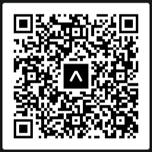

# Kobool MVP

## Development setup

1. Make sure to have [Node.js](https://nodejs.org/en/) installed.
2. Make sure to have [Expo CLI](https://docs.expo.dev/get-started/installation/) installed.
3. [Clone](https://docs.github.com/en/repositories/creating-and-managing-repositories/cloning-a-repository) this repository to your local machine.
4. Run: `npm install`
5. After the installation is complete, run: `npx expo start --tunnel` or `npx expo start --tunnel -c` (no cache)
6. This will give you a QR code. Follow the instructions on the terminal to use the app.
7. Read [this](#qr-codes-for-the-test-version-of-the-app) to learn how to scan the QR codes and open the Koobool MVP app (IOS and Android).

## QR codes for the test version of the app

### IOS

1. Install the [Expo Go](https://apps.apple.com/us/app/expo-go/id982107779) app from the App Store.
2. Scan the QR code using your phone camera.
3. Open the app using Expo Go app (follow the prompt on your screen).

### Android

1. Install the [Expo](https://play.google.com/store/apps/details?id=host.exp.exponent&hl=en_GB&gl=US) app from the Google Play Store.
2. Open the app.
3. Scan the QR code using the app.
4. This will open the Koobool app on your phone.

